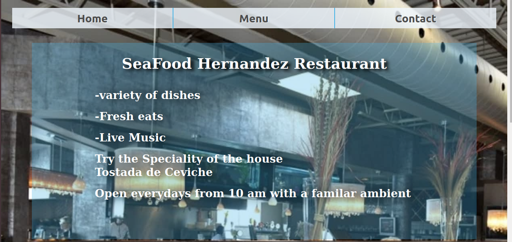

# Restaurant Web page

> Project taked from Microverse Curriculum from the The Odin Page project site.

Javascript with Webpack project from The Odin Project [curriculum](https://www.theodinproject.com/lessons/restaurant-page)

## Built With Javascript and Webpack

- Html,Css,JavaScript
- Webpack
- npm manager

## Live Demo

[Live Demo Link](https://livedemo.com)

## Getting Started

**This is an example of how you may give instructions on setting up your project locally.**
**Modify this file to match your project, remove sections that don't apply. For example: delete the testing section if the currect project doesn't require testing.**

To get a local copy up and running follow these simple example steps.

### Prerequisites

-before to run this project you will need to install before webpack and configure the live server on your webpac.config file. you can check more about it on this [page](https://webpack.js.org/guides/installation/) .
[npm install and config: ](https://docs.npmjs.com/cli/install)

### Setup

To use this project you will need to download this repository and put in on your computer.
after you will need to install webpack and npm to run correctlly this project.

### Deployment

To deploy the application and see it on the browser you can use npm to do that task on the server provider by webpack. to run the live server you will need to open your project folder terminal and run this commands:
run `npm install`
run `npm run build`

## Authors

👤 **MephistoDevelop**

- Github: [@MephistoDevelop](https://github.com/MephistoDevelop)
- Twitter: [@MephistoDevelop](https://twitter.com/MephistoDevelop)
- Linkedin: [linkedin](https://www.linkedin.com/in/cristian-hernandez1992/)

## 🤝 Contributing

Contributions, issues and feature requests are welcome!

Feel free to check the [issues page](issues/).

## Show your support

Give a ⭐️ if you like this project!

## Acknowledgments

This page was inspired by my own bussines i'm a food-seller on my free times while im not writing code.

## 📝 License

This project is [MIT](lic.url) licensed.

### Author:

[Cristian Ines (MephistoDevelop)](https://github.com/MephistoDevelop)
